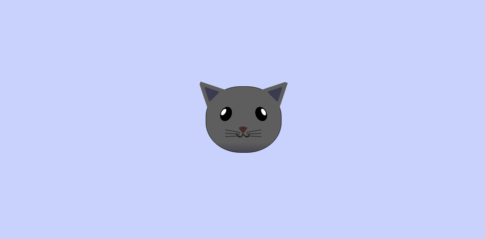

## FreeCodeCamp - City Skyline

## Table of contents

- [Overview](#overview)
  - [The challenge](#the-challenge)
  - [Screenshot](#screenshot)
  - [Links](#links)
- [My process](#my-process)
  - [built with](#built-with)
  - [What i learned](#what-i-learned)
- [Author](#author)
- [Acknowledgements](#acknowledgements)

## Overview

### The challenge

Build a Cat Painting and get it looking as close to the original design as possible.

Users should be able to:

- View the optimal layout depending on their device's screen size.
- See hover states for interactive elements.

### Screenshot

### Links

- Live Site URL: [City Skyline](https://muhdal-amin.github.io/city_skyline/)

## My process

### Built with

- HTML5
- CSS3

### What i learned

- Semantic HTML
- CSS Positioning (Fixed, Absolute, Sticky, Static, Relative....)
- CSS Transforms (Rotate, Skew, Scale...)

## Author

- GitHub - [@Muhdal-Amin](https://github.com/Muhdal-Amin)

## Acknowledgements

Challenge and Style guide by [FreeCodeCamp.org](https://www.freecodecamp.org/)